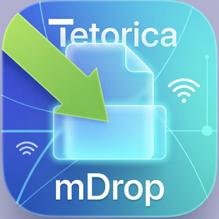

# Tetorica mDrop

Local Network File Sharing Tool (No Install, No Cloud)

Tetorica mDrop is a simple tool for sharing files within a local network.
Just drag and drop files, and any device on the same Wi-Fi can download them through a browser.




```
---

Features

* Drag & Drop file sharing
* Click to select files (file picker supported)
* Accessible from any browser (no install required on clients)
* Bonjour (mDNS) for automatic discovery
* Works on iPhone / iPad / Windows / Mac
* Fast local network transfer (no cloud needed)

---

Quick Start

1. Start the server

Launch the app and click:

* Start Server
* Start Bonjour

2. Open in browser

On any device connected to the same Wi-Fi:

[http://tetorica-mdrop.local:7878/](http://tetorica-mdrop.local:7878/)

or

http://<your-ip-address>:7878/

3. Share files

* Drag & drop files into the app
* Or click to select files

Files will instantly appear in the list and become downloadable.

---

How It Works

Drop a file on your Mac
→ Open the URL on your phone or other devices
→ Select the file and download

No accounts, no uploads, no cloud.

---

Why Tetorica mDrop?

Simpler than SMB

* No permissions or credentials
* No OS-specific setup
* No path configuration

Faster than Cloud

* No internet required
* Runs entirely within your local network

Perfect for training sessions and events

* Easy distribution to multiple participants
* No setup on client devices
* Minimal troubleshooting

---

Limitations

* Performance depends on local network conditions
* Large files and many simultaneous downloads may slow down
* Currently single-node distribution (not P2P yet)

---

Tech Stack

* Tauri
* Axum
* Tokio
* Tailwind CSS
* Bonjour / mDNS

---

Future Ideas

* LAN-based P2P distribution (swarm)
* Download progress tracking
* ZIP bundling
* Video streaming support
* QR code sharing

---

License

MIT

---

Author

Tetorica Project

---
```


# Q/A
## Firewall settings (if you cannot connect)

If devices on the same network cannot access Tetorica mDrop, your firewall may be blocking incoming connections.

---

### macOS

1. Open **System Settings**
2. Go to **Network → Firewall**
3. Click **Options**
4. Add Tetorica mDrop to the allowed apps list
5. Set it to **Allow incoming connections**

For testing, you can temporarily disable the firewall:

```bash
sudo /usr/libexec/ApplicationFirewall/socketfilterfw --setglobalstate off
```

## Windows
- 1 Open Windows Security
- 2 Go to Firewall & network protection
- 3 Click Allow an app through firewall
- 4 Add Tetorica mDrop (or your app)
- 5 Enable it for Private networks
- 6 For testing, you can temporarily disable the firewall:

```

netsh advfirewall set allprofiles state off

```

## macOS: Allow Chrome to access the local network

On macOS, Chrome may be blocked from accessing devices on your local network.

If you cannot open Tetorica mDrop in Chrome, enable local network access:

1. Open **System Settings**
2. Go to **Privacy & Security**
3. Select **Local Network**
4. Find **Google Chrome** and turn it **ON**

After enabling this, restart Chrome and try again.

## Notes

Make sure both devices are on the same Wi-Fi / LAN.
If curl works but the browser does not, the issue may be browser security (especially Chrome).
Using the IP address (e.g. http://192.168.x.x:7878/) is more reliable than .local hostname.


# Deploy

```
% sh deploy_mac.sh
% ~/bin/butler login
% ~/bin/butler push src-tauri/target/release/bundle/dmg/tetorica-mdrop_0.1.7_aarch64.dmg kyorohiro/tetorica-mdrop:mac-apple-silicon --userversion 0.1.7

% ~/bin/butler push src-tauri/target/x86_64-apple-darwin/release/bundle/dmg/tetorica-mdrop_0.1.7_x64.dmg kyorohiro/tetorica-mdrop:mac-intel --userversion 0.1.7

% ~/bin/butler push "tetorica-mdrop_0.1.7_x64-setup.exe" kyorohiro/tetorica-mdrop:windows --userversion 0.1.7
```

# Memo

```
% dns-sd -B _http._tcp
Browsing for _http._tcp
DATE: ---Sun 26 Apr 2026---
 0:45:51.409  ...STARTING...
Timestamp     A/R    Flags  if Domain               Service Type         Instance Name
 0:45:51.410  Add        3   1 local.               _http._tcp.          Tetorica mDrop
 0:45:51.410  Add        2  11 local.               _http._tcp.          Tetorica mDrop

% dns-sd -L "Tetorica mDrop" _http._tcp local
Lookup Tetorica mDrop._http._tcp.local
DATE: ---Sun 26 Apr 2026---
 0:46:21.697  ...STARTING...
 0:46:22.128  Tetorica\032Home\032Server._http._tcp.local. can be reached at tetorica-mdrop.local.:7878 (interface 11)
 path=/
 ```

